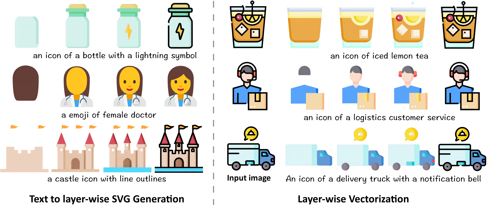

# LayerTracer
**LayerTracer: Cognitive-Aligned Layered SVG Synthesis via  Diffusion Transformer**
<br>
[Yiren Song](https://scholar.google.com.hk/citations?user=L2YS0jgAAAAJ), 
[Danze Chen](https://scholar.google.com/citations?hl=en&user=7XRxZr0AAAAJ), 
and 
[Mike Zheng Shou](https://sites.google.com/view/showlab)
<br>
[Show Lab](https://sites.google.com/view/showlab), National University of Singapore
<br>

<a href="https://arxiv.org/abs/2502.01105"></a>

<br>



## Installation
### 1. **Environment setup**
```bash
git clone https://github.com/showlab/LayerTracer.git
cd LayerTracer

conda create -n layertracer python=3.11.10
conda activate layertracer
```
### 2. **Requirements installation**
```bash
pip install --upgrade -r requirements.txt
```
## Inference
### 1. **Text 2 Sequence**
According to the actual situation, replace all model paths, file paths, and parameters in 'scripts/text2sequence.sh'.

```bash
chmod +x scripts/text2sequence.sh
scripts/text2sequence.sh
```

### 2. **Image 2 Sequence**
According to the actual situation, replace all model paths, file paths, and parameters in 'scripts/image2sequence.sh'.

```bash
chmod +x scripts/image2sequence.sh
scripts/image2sequence.sh
```

## QuickStart
### 9grid Sequence(blackline) to SVG
```bash
python layertracer_icon_9grid.py --input input/image.png --output output/
```
- `--input` : Input image path.
- `--output` : Output directory.
- `--colormode`: choices=['color', 'binary'], Color mode for SVG conversion.
- `--mode` : choices=['spline', 'polygon', 'none'], Tracing mode for SVG conversion.
- `--filter_speckle` : Speckle filter threshold.
- `--color_precision` : Color precision for SVG conversion.
- `--corner_threshold`: Corner detection threshold.
- `--length_threshold` : Length threshold for path simplification, in [3.5, 10].
- `--splice_threshold` : Splice threshold for path merging.
- `--path_precision` : Path precision for SVG conversion.

## Citation
```
@inproceedings{Song2025LayerTracerCL,
  title={LayerTracer: Cognitive-Aligned Layered SVG Synthesis via Diffusion Transformer},
  author={Yiren Song and Danze Chen and Mike Zheng Shou},
  year={2025},
  url={https://api.semanticscholar.org/CorpusID:276094351}
}
```
